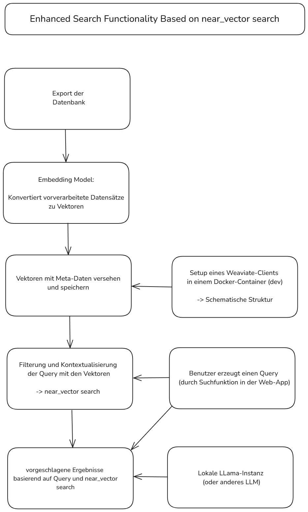
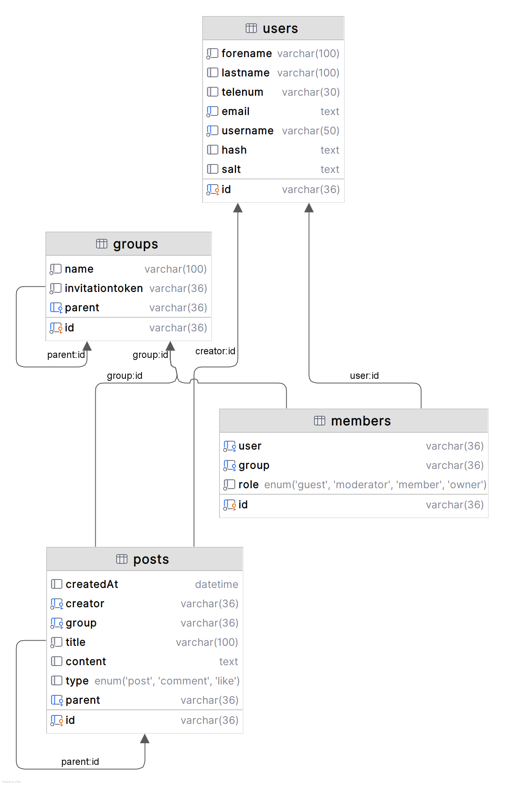

Backend-ReadMe

# HexMaster Backend

## Overview
 The backend provides with a MariaDB for the persisteant data for the frontend.
 Plan was it to have a [vectorbased DB](https://weaviate.io/) as well for advanced search with semantic similarities and a LLM.
 A easy local setup with the Databases is included in the docker-compose.yml in `local-dev-setup` folder. A local installation of [Ollama](https://ollama.com/download) is requiered.

## Project Structure

The project is organized as follows:

- `main.go`: The entry point of the application. It sets up the routes for the REST-API
- `api/`: Contains the API related programm.
  - `middleware`: Contains authentication (JWT), fail security and logging
  - `handler/`: Contains the logic for handling different API endpoints.
  - `response/`: Contains the response structure and methods.
- `database/`: Contains the SQL-Database connection and generic query methods.
- `llama`: Http client for Llama3 REST-API.
- `weaviate` Vector creation and storing.

  ## MariaDB
Due to the small size and requirements of the POC, we have opted for an sql-based database. 

